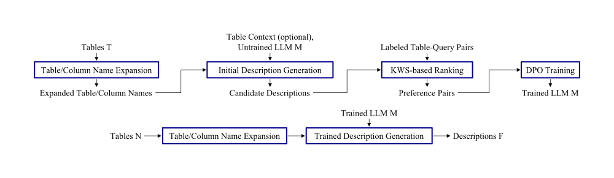

<p align="center">
  <picture>
    <source media="(prefers-color-scheme: dark)" srcset="figures/logo-dark.svg">
    
  </picture>
</p>

# Polaris: Learning to Generate Table Descriptions from Retrieval Feedback

[](https://www.python.org/downloads/)
[](https://huggingface.co/meta-llama/Llama-3.1-8B-Instruct)
[](https://huggingface.co/meta-llama/Llama-4-Maverick-17B-128E-Instruct)

## Overview

Polaris is a system that trains an LLM to generate table descriptions directly from
retrieval feedback. Keyword search over tables is difficult because table and column
names are often cryptic and short (e.g., `DTPh` for "daytime phone"). LLM-generated
descriptions improve retrieval, but are typically optimized for fluency rather than
retrieval effectiveness.

The key insight is that existing table retrieval benchmarks already contain the
supervision needed for this task: given query–table relevance judgments, Polaris
generates multiple candidate descriptions for each table, ranks them by their BM25
retrieval effectiveness, and uses the resulting preference pairs to fine-tune the LLM
with Direct Preference Optimization (DPO). Polaris further expands abbreviated table and
column names before generation to reduce vocabulary mismatch.



Polaris runs in two stages: fine-tuning the LLM from retrieval feedback (top row),
then using the trained LLM to generate descriptions (bottom row).

See the Polaris paper (full citation below) for details.

## Installation

Polaris requires `Python 3.10+`, an `AWS Bedrock token`, a `Hugging Face token`,
a `GPU`, `Elasticsearch`, and `Docker`.

To set up, run:

```bash
pip install -r requirements.txt
pip install -r requirements-gpu.txt
docker compose up -d     # starts Elasticsearch on localhost:9200
cp .env.example .env     # then edit .env: fill in HF_TOKEN and AWS_BEARER_TOKEN_BEDROCK
```

The commands read `.env` automatically.
If you already have an Elasticsearch server, skip `docker compose up -d` and add
`--es-url <your server's URL>` to the commands that use Elasticsearch
(`polaris.train` and `evaluation/evaluate.py`).

If the model download stalls with `DownloadStallError`, run
`pip uninstall -y hf_transfer` and rerun the command — the partial download
resumes.

## Polaris Datasets

We released the six datasets used in the Polaris paper on the
[Hugging Face Hub](https://huggingface.co/collections/anhaidgroup/polaris-v1),
in two versions: v1 contains each table's metadata,
the queries, and the relevance labels; v2 adds the tables' full contents.
The Polaris solution only uses the metadata, so v1 (~14 MB in total) suffices. To
download it:

```bash
python data/download.py
```

| Dataset | Domain | # Tables | # Queries |
|---|---|---:|---:|
| aw | Enterprise (AdventureWorks) | 96 | 15 |
| arctic | Science (EDI) | 251 | 20 |
| lter | Science (EDI) | 2,015 | 15 |
| ecir | Government (data.gov) | 2,100 | 12 |
| wikitables | Web (Wikipedia) | 3,361 | 57 |
| wtr | Web (CommonCrawl) | 4,634 | 60 |

See [`data/README.md`](data/README.md) and the Hub repos (`anhaidgroup/polaris-{name}-v1`)
for details and per-dataset licenses.

## Running Polaris

Polaris trains the LLM on training datasets, then generates descriptions for an
unseen test dataset (leave-one-dataset-out). The example below trains on five of
the six released datasets and tests on `aw`.

### Option 1 (Recommended): Quick Run

**1. Train the LLM.** This command reads the training datasets from `data/`
and writes the trained model (a LoRA adapter) to `out/adapter`:

```bash
python -m polaris.train --datasets arctic ecir lter wikitables wtr
```

| Argument | Meaning |
|---|---|
| `--datasets` | the training datasets, as folder names under `data/` |
| `--es-url` | your Elasticsearch server (default: `http://localhost:9200`) |

The default training configuration is the paper's (3 candidate descriptions
per table, LoRA r=64, β=0.1, lr 5e-6, 1 epoch). To change it, edit
`DPO_DEFAULTS` in [`polaris/dpo.py`](polaris/dpo.py).

**2. Generate descriptions.** This command reads the test dataset from `data/`
and the trained model, and writes one description per table to
`descriptions_{dataset}.jsonl`:

```bash
python -m polaris.generate_descriptions --datasets aw
```

| Argument | Meaning |
|---|---|
| `--datasets` | the datasets to describe |
| `--adapter` | the trained model (default: `out/adapter`) |

Run both commands from one working directory: the stages pass files to each
other there, and an interrupted run picks up its finished outputs instead of
redoing them.

### Using your own dataset

To use your own dataset, set it up as a folder under `data/` in the released
format ([`data/README.md`](data/README.md) explains it). The example below
trains on the six released datasets, then generates descriptions for your
dataset `mydata`:

```bash
python -m polaris.train --datasets aw arctic ecir lter wikitables wtr
python -m polaris.generate_descriptions --datasets mydata
```

### Option 2: Run Step by Step

You can also run the pipeline one stage at a time, to customize a stage or to
inspect its output before moving on. Each stage is its own command; see
`python -m polaris.<stage> --help` for its arguments:

```bash
# Training stage
python -m polaris.expand_names --datasets arctic ecir lter wikitables wtr
python -m polaris.generate_candidates --datasets arctic ecir lter wikitables wtr
python -m polaris.generate_preference_pairs --datasets arctic ecir lter wikitables wtr
python -m polaris.dpo

# Inference stage
python -m polaris.expand_names --datasets aw
# generate_descriptions reuses the expansions written above; it does not re-expand
python -m polaris.generate_descriptions --datasets aw
```

The `examples/` files show ten sample rows of each stage's output:

| Stage | Example output |
|---|---|
| `expand_names` | [`name_expansion_examples.jsonl`](examples/name_expansion_examples.jsonl) |
| `generate_preference_pairs` | [`preference_pair_examples.jsonl`](examples/preference_pair_examples.jsonl) |
| `generate_descriptions` | [`description_examples.jsonl`](examples/description_examples.jsonl) |

## Evaluation

Suppose we have trained the LLM and want to test its performance on `aw`. The
`generate_descriptions` command above wrote a description for each of `aw`'s
tables to `descriptions_aw.jsonl`; the following command evaluates the
keyword-search performance of these descriptions:

```bash
python evaluation/evaluate.py --descriptions descriptions_aw.jsonl --dataset aw
```

For each keyword query, we return a ranked list of tables, where each table is
ranked based on the BM25 score between its description and the query. The command
prints two accuracy measures widely used in keyword-search research: NDCG@K
(ranking quality with graded relevance) and Recall@K, for K = 5, 10, 20, 50, 100.

The evaluation also works for descriptions produced by any other method: pass a
file with one JSON line per table, holding `table_id` and `description`, and the
same command scores it on the same datasets.

## Citation

```bibtex
@article{polaris2026,
  title  = {Polaris: Learning to Generate Table Descriptions from Retrieval Feedback},
  author = {Cai, Ting and Phan, Tuan Minh and Doan, AnHai},
  year   = {2026},
  note   = {arXiv}
}
```
